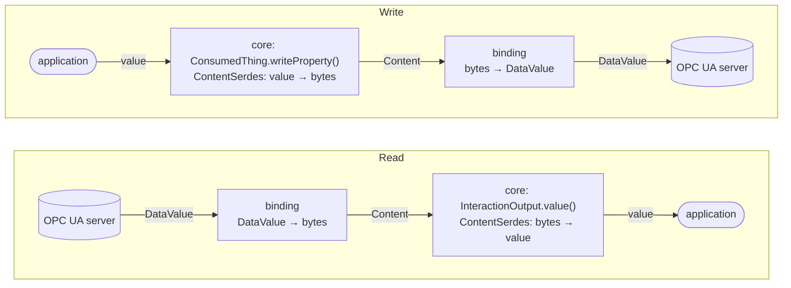

# binding-opcua — design notes

Background for reviewers and for whoever maintains this binding next. The user-facing
documentation is in [../README.md](../README.md); these pages explain _why_ the binding behaves
as it does, and where it knowingly differs from the specifications.

| page                                             | what it answers                                                                                                                                               |
| ------------------------------------------------ | ------------------------------------------------------------------------------------------------------------------------------------------------------------- |
| [content-negotiation.md](content-negotiation.md) | Which `contentType` a form may use, what each one produces, and how a value travels between the OPC UA server and a WoT application                           |
| [opcua-json-encoding.md](opcua-json-encoding.md) | The essence of OPC UA JSON: Compact and Verbose, the deprecated Reversible/NonReversible pair we currently emit, and what each OPC UA type looks like in both |
| [decisions.md](decisions.md)                     | The choices made, with their reasons and their known costs                                                                                                    |
| [diagrams/](diagrams/)                           | PlantUML sources of the sequence diagrams used in these pages                                                                                                 |

## The one thing to know first

An OPC UA value crosses **two** converters, and only one of them belongs to this binding:

The binding controls the encoding on read and the decoding on write. The other half is core's
`ContentSerdes`, which picks a codec by media type for the whole servient. That is why
`application/octet-stream` used to reach the codec that packs Modbus registers, and why the
binding now registers its own codec for the `opc.tcp` scheme (core issue #1409, PR #1572).

## What is special about OPC UA here

-   **The server, not the Thing Description, knows the type.** Every value read carries its OPC UA
    DataType, and the node's DataType can be read before a write. The TD's `type` is a description
    for consumers, not the source of truth for decoding.
-   **OPC UA already defines JSON encodings of its own**, including which media type means what
    (OPC 10000-6 §7.4.2, Table 80). The binding follows those rather than inventing a scheme,
    except where a WoT consumer would be left with something it cannot use — see
    [decisions.md](decisions.md).
-   **The type system is wider than JSON's.** 64-bit integers, ByteStrings, NodeIds, LocalizedTexts,
    structures (ExtensionObjects), arrays and matrices all have to survive a round trip through a TD
    that can only describe JSON. [content-negotiation.md](content-negotiation.md) has the measured
    results per type.
