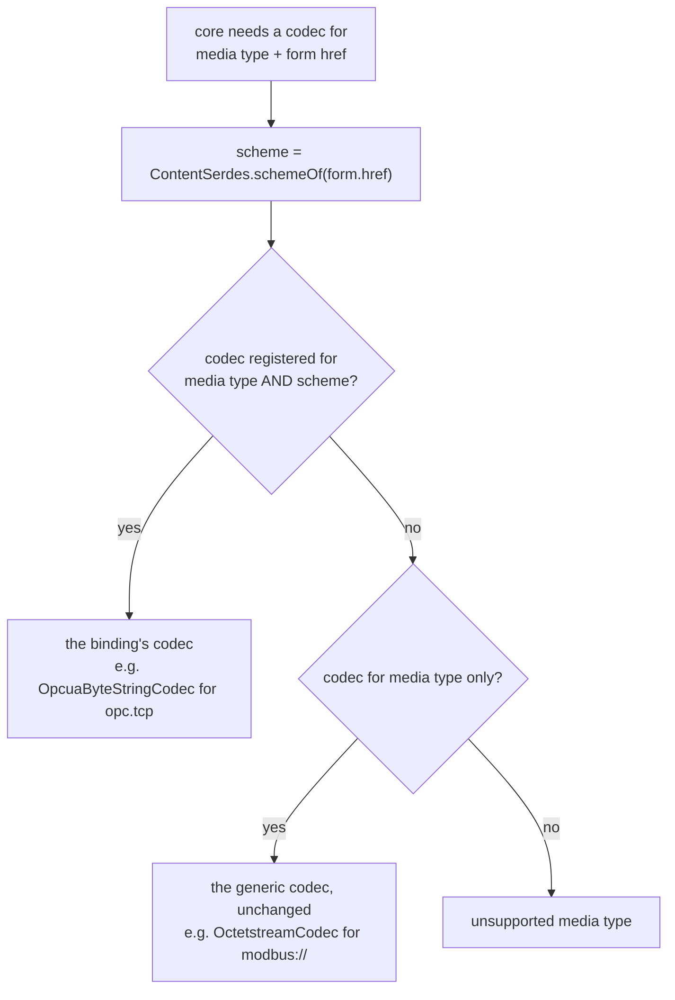
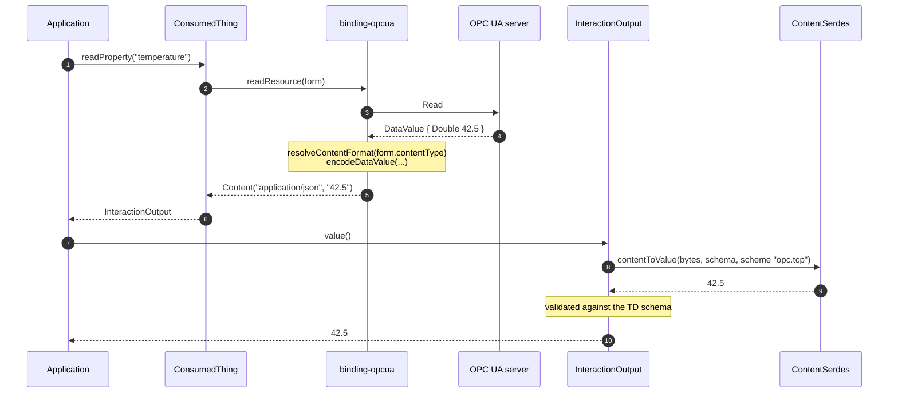
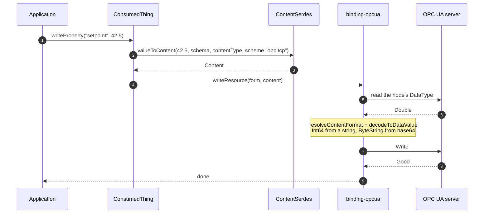

# Content negotiation

How a `contentType` on an OPC UA form decides what crosses the wire and what a WoT application
receives. Background: issue #1400, core issue #1409 and PR #1572.

## What each contentType means

| contentType                                                  | what the application sees                                                                         | notes                                                          |
| ------------------------------------------------------------ | ------------------------------------------------------------------------------------------------- | -------------------------------------------------------------- |
| omitted, i.e. `application/json`                             | the bare value: `42.5`, `"hello"`, `[1,2,3]`                                                      | the default fixed by W3C WoT TD 1.1 §5.3.4.2                   |
| `application/opcua+json;type=Value`                          | the bare value                                                                                    | same as above, stated explicitly                               |
| `application/opcua+json;type=Variant`                        | value and OPC UA type: `{"Type":11,"Body":42.5}`                                                  | lossless, see [opcua-json-encoding.md](opcua-json-encoding.md) |
| `application/opcua+json;type=DataValue` (the default `type`) | value, status code and timestamps                                                                 | lossless                                                       |
| `application/opcua+octet-stream`                             | OPC UA Binary                                                                                     | for consumers that are themselves OPC UA clients               |
| `application/octet-stream`                                   | the raw bytes of a single ByteString; base64 through `value()`, the bytes through `arrayBuffer()` | images, files. Any other OPC UA type is refused                |

Anything else is refused with an error naming the form, rather than handed to a codec that knows
nothing about OPC UA.

## Where each conversion happens

The binding owns the OPC UA side of both directions. Core owns the media-type side: it decodes
what a read returned, and encodes what a write sends. Since PR #1572 a binding can register a
codec for its own URI scheme, so `application/octet-stream` on an `opc.tcp://` form no longer
reaches the codec that packs Modbus registers:

```ts
// src/factory.ts
contentSerdes.addCodec(new OpcuaByteStringCodec(), false, "opc.tcp");
```



## Read

The server supplies the type; the TD does not have to.



## Write

The binding asks the server for the node's DataType before building the Variant, so a TD that
says `"number"` still writes an Int32 to an Int32 node and an Int64 to an Int64 node.



PlantUML sources of both: [diagrams/](diagrams/).

## What each OPC UA type does

Measured by reading a value, writing the same value back and comparing what the server holds
(`test/octet-stream-shapes-test.ts`, `test/contenttype-write-test.ts`). ✔ means the server ends up
with the value it started with.

| OPC UA value                                                | `application/json` read            | write back, bare value                     | write back, `Variant` / `DataValue` | `application/octet-stream`                 |
| ----------------------------------------------------------- | ---------------------------------- | ------------------------------------------ | ----------------------------------- | ------------------------------------------ |
| Double, Int32, Float, Byte, Boolean, String, Guid, DateTime | the plain value                    | ✔                                         | ✔                                  | refused, not a ByteString                  |
| Int64, UInt64                                               | a string, as JSON cannot hold 2^53 | ✔                                         | ✔                                  | refused                                    |
| Enumeration                                                 | the number                         | ✔                                         | ✔                                  | refused                                    |
| ByteString                                                  | base64                             | ✔                                         | ✔                                  | ✔ raw bytes                               |
| arrays of the above                                         | a JSON array                       | ✔                                         | ✔                                  | refused                                    |
| ByteString[]                                                | array of base64                    | ✘ the base64 text is stored, not the bytes | ✔                                  | refused: a raw stream cannot frame several |
| LocalizedText                                               | the text only                      | ✘ the locale is lost                       | ✔                                  | refused                                    |
| NodeId, QualifiedName                                       | an object                          | ✘ not converted back                       | ✔                                  | refused                                    |
| matrices (`Double[2][3]`)                                   | an envelope with `Dimensions`      | ✘                                          | ✔                                  | refused                                    |
| ExtensionObject, arrays and matrices of them                | the structure's fields             | ✘ a plain object is not an ExtensionObject | ✘ under investigation               | refused                                    |

Two conclusions worth keeping in mind:

-   **`opcua+json;type=Variant` and `type=DataValue` are the lossless forms.** Use them when a value
    must survive a round trip exactly.
-   **The bare value is lossy by construction for some types**, and several rows above are
    shortcomings of this binding rather than of OPC UA: most of them disappear with the 1.05
    encoding, which keeps the locale of a LocalizedText and writes a NodeId as a plain string. See
    [opcua-json-encoding.md](opcua-json-encoding.md).

## Things that are not this binding's to fix

-   **A read is validated against the TD schema by core**, after decoding. A TD that declares
    `"type": "number"` and asks for `type=DataValue` gets `Invalid value according to DataSchema`,
    because a DataValue is an object. A TD with no `type` gets `No schema type defined` before
    decoding even starts. See node-wot issues #1243 and #1265.
-   **`application/octet-stream` writes were impossible before PR #1572**, because core serializes a
    value before the binding is called.
